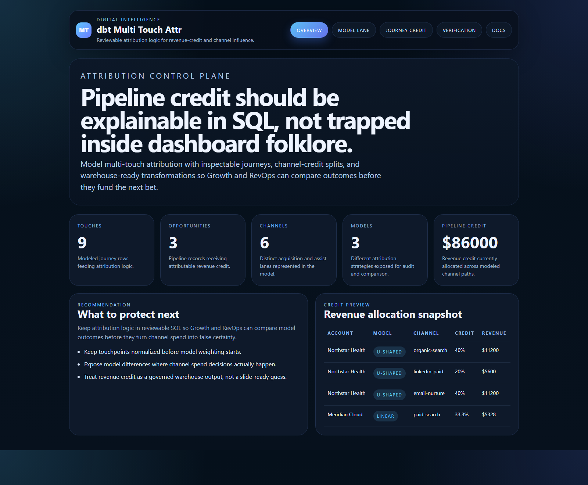
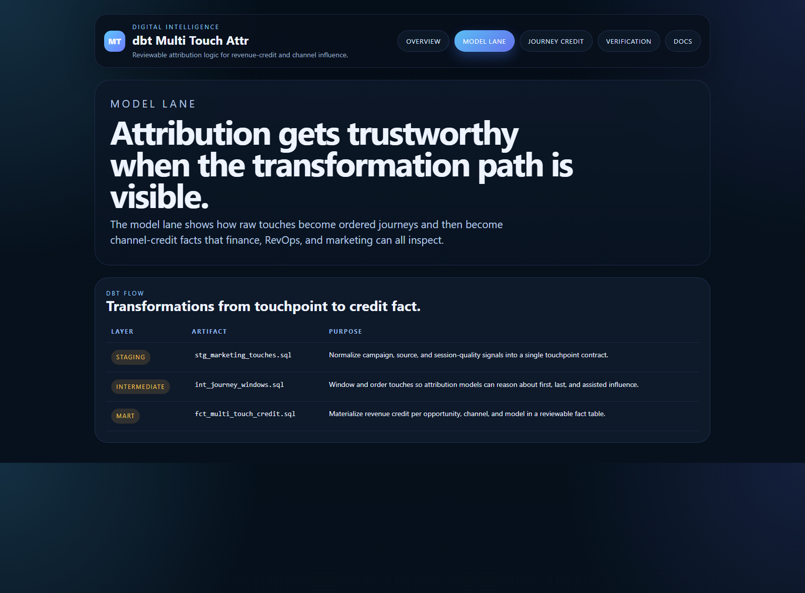
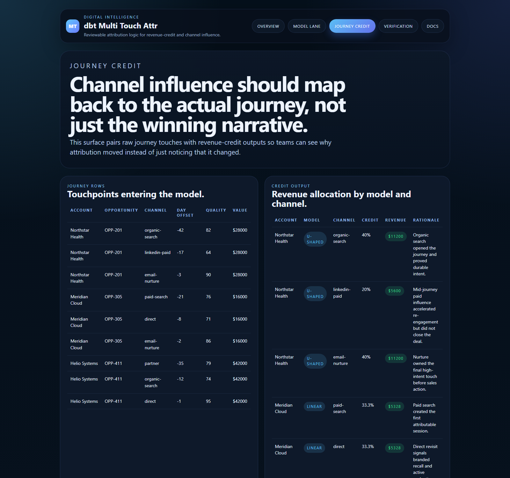
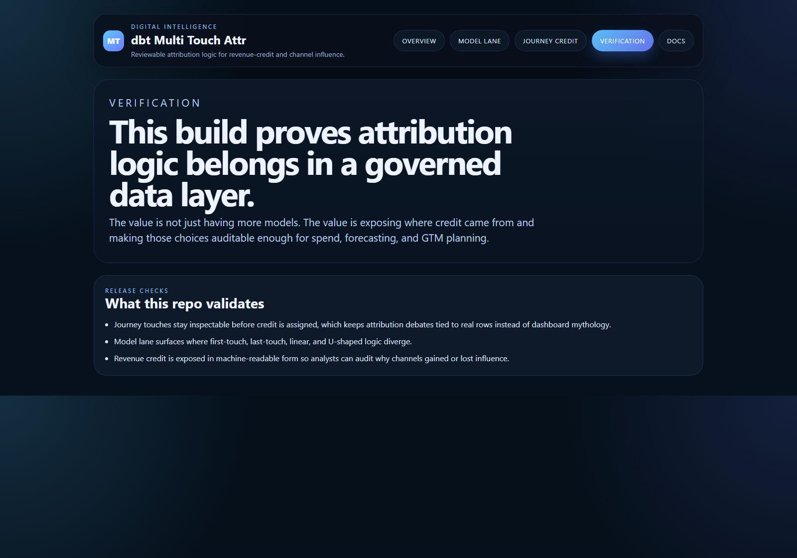

# dbt Multi Touch Attr

TypeScript control plane plus dbt-style SQL assets for multi-touch attribution, journey stitching, and reviewable revenue-credit logic.

## Why this exists

Attribution breaks down when teams can see the chart but not the underlying journey logic. The common problems are predictable:
- raw touches are not normalized before model weighting begins
- first-touch and last-touch debates happen without inspectable path rows
- channel credit moves, but nobody can explain why
- revenue influence becomes a dashboard story instead of a warehouse contract

`dbt-multi-touch-attr` treats attribution as a governed data product. It keeps the transformation path, journey rows, and revenue-credit outcomes visible in one place.

## Routes

- `/`
- `/model-lane`
- `/journey-credit`
- `/verification`
- `/docs`

## API

- `/api/dashboard/summary`
- `/api/model-lane`
- `/api/journey-credit`
- `/api/journeys`
- `/api/verification`
- `/api/sample`

## Screenshots






## Local Development

```powershell
cd dbt-multi-touch-attr
npm install
npm run dev
```

Open:
- [http://127.0.0.1:5274/](http://127.0.0.1:5274/)
- [http://127.0.0.1:5274/model-lane](http://127.0.0.1:5274/model-lane)
- [http://127.0.0.1:5274/journey-credit](http://127.0.0.1:5274/journey-credit)
- [http://127.0.0.1:5274/verification](http://127.0.0.1:5274/verification)
- [http://127.0.0.1:5274/docs](http://127.0.0.1:5274/docs)

## Validation

- `npm run build`
- `npm run test`
- `npm run demo`
- `npm run smoke`
- `npm run render:assets`

## Warehouse Assets

- [models/staging/stg_marketing_touches.sql](./models/staging/stg_marketing_touches.sql)
- [models/intermediate/int_journey_windows.sql](./models/intermediate/int_journey_windows.sql)
- [models/marts/fct_multi_touch_credit.sql](./models/marts/fct_multi_touch_credit.sql)
- [models/schema.yml](./models/schema.yml)

## Docs

- [Architecture](./docs/architecture.md)
- [Origin](./docs/ORIGIN.md)
- [Changelog](./CHANGELOG.md)
