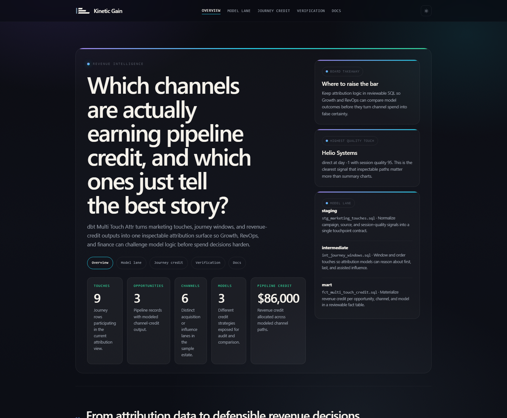
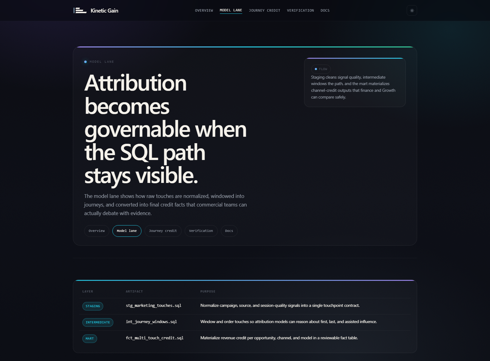
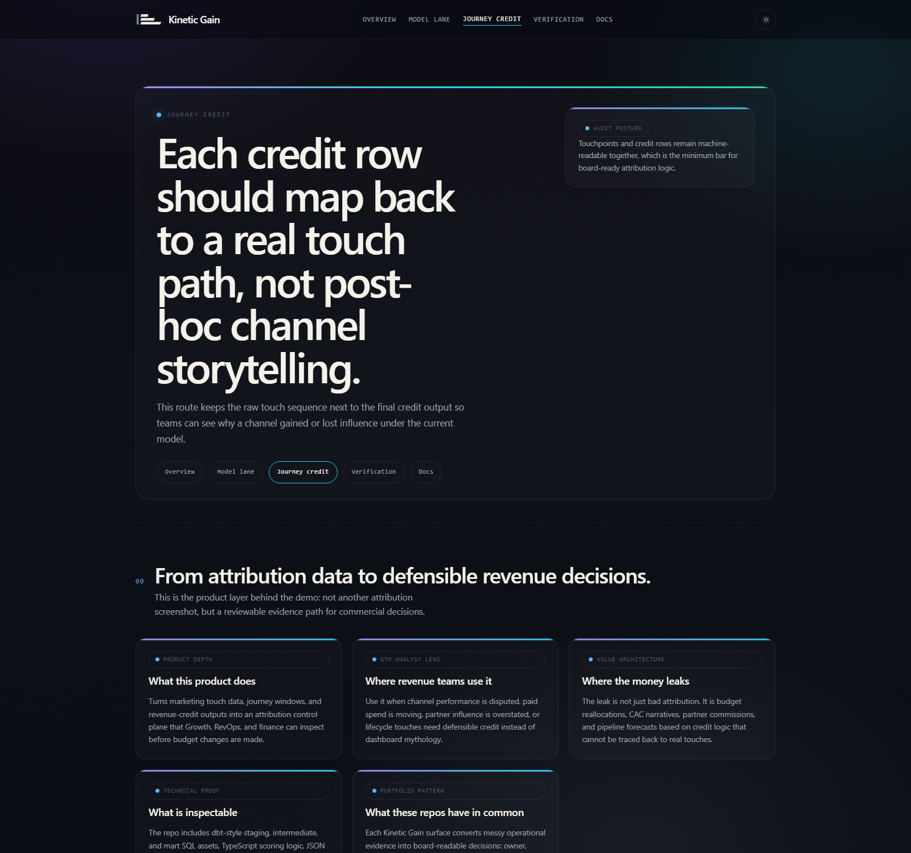
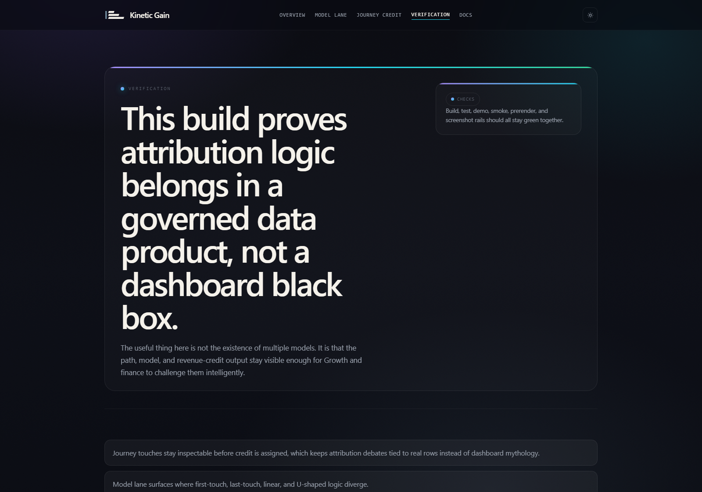

# dbt Multi Touch Attr

Board-ready attribution surface for journey stitching, model comparison, and reviewable revenue-credit logic.

- Live target: [http://attribution.kineticgain.com/](http://attribution.kineticgain.com/)
- Repo: [mizcausevic-dev/dbt-multi-touch-attr](https://github.com/mizcausevic-dev/dbt-multi-touch-attr)

## Why this matters

Attribution usually fails in the same way:
- teams see credit outputs but not the touch path that produced them
- finance sees influenced revenue without enough model explainability
- RevOps inherits weighting logic that cannot be challenged lane by lane
- budget conversations happen after credit has already hardened into dashboard mythology

`dbt-multi-touch-attr` keeps the transformation flow, journey rows, and revenue-credit allocations visible in one place so channel influence remains inspectable.

## What it includes

- TypeScript executive intelligence surface for attribution posture and model governance
- journey-level touch inspection next to final credit allocations
- dbt-style staging, intermediate, and mart SQL assets
- prerendered static site, JSON payloads, screenshots, and docs

## Routes

- `/`
- `/model-lane`
- `/journey-credit`
- `/verification`
- `/docs`

## API

- `/api/dashboard/summary`
- `/api/model-lane`
- `/api/journey-credit`
- `/api/journeys`
- `/api/verification`
- `/api/sample`

## Local run

```powershell
cd dbt-multi-touch-attr
npm install
npm run verify
npm run prerender
npm run render:assets
```

## Screenshots






## Warehouse assets

- [models/staging/stg_marketing_touches.sql](./models/staging/stg_marketing_touches.sql)
- [models/intermediate/int_journey_windows.sql](./models/intermediate/int_journey_windows.sql)
- [models/marts/fct_multi_touch_credit.sql](./models/marts/fct_multi_touch_credit.sql)
- [models/schema.yml](./models/schema.yml)

## Docs

- [Architecture](./docs/architecture.md)
- [Origin](./docs/ORIGIN.md)
- [Changelog](./CHANGELOG.md)
